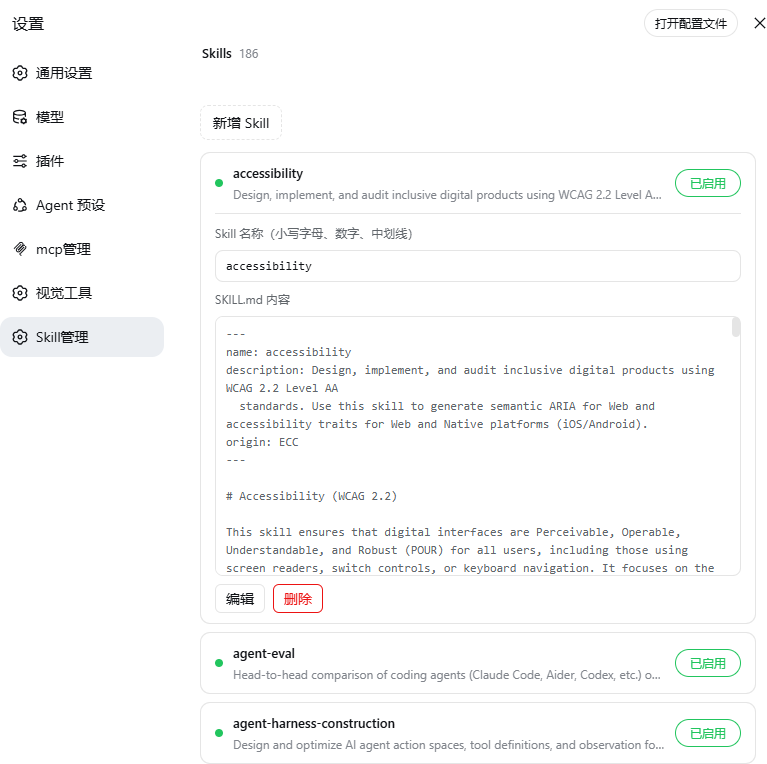

# dsh-skill-manager

DeepSeek Harness (DSH) 的 Skill 管理插件——在 Web 设置里管理所有用户级 Skill：查看、启用/停用、编辑、新增、删除、改名。停用的 Skill 会从模型目录中排除（不再加载）。

[](https://www.npmjs.com/package/@wanghailong0419/dsh-skill-manager)
[](LICENSE)



## 功能

- **Skill 列表**：进入设置 → "Skill管理"，列出 `$DSH_HOME/skills` 下全部 Skill（名称 + 描述）
- **点击展开 / 收起**：点击行任意位置展开详情（Skill 名称 + SKILL.md 内容），再点收起（输入框与按钮除外）
- **启用 / 停用**：每个 Skill 一个开关，切换即生效，本地更新不闪烁
- **编辑 / 改名**：内联编辑名称与 SKILL.md 内容，改名会同步重命名目录
- **新增 / 删除**：内联表单创建新 Skill，删除有二次确认
- **关闭即不加载**：停用时修改 SKILL.md frontmatter 加 `disable-model-invocation: true`，DSH 的 skill-filesystem watcher 检测到后立即从模型目录排除该 Skill，无需重启

## 架构

单包双半的 DSH bundle：

| 半 | 入口 | 角色 |
|---|---|---|
| Host | `lib/index.js` | `skillManager` Remote 服务：skillList / skillSet / skillGet / skillCreate / skillUpdate / skillDelete / skillRename，编辑 SKILL.md frontmatter |
| Client | `lib/client.js` | 设置面板 "Skill管理" 分区（`dsh.client` bundle） |

## 安装

```bash
dsh plugin --profile web add @wanghailong0419/dsh-skill-manager
dsh web   # 重启生效
```

### 本地开发 / 未发布时

```bash
dsh plugin --profile web add file:/path/to/dsh-skill-manager
dsh web
```

### 升级 / 移除

```bash
dsh plugin --profile web update @wanghailong0419/dsh-skill-manager
dsh plugin --profile web remove @wanghailong0419/dsh-skill-manager
```

## 使用

1. 启动 `dsh web`，打开**设置 → Skill管理**
2. 列表显示每个 Skill：状态点（绿=启用 / 灰=停用）、名称、描述
3. 点右侧开关切换启用/停用
4. 点击行展开详情：查看 Skill 名称与 SKILL.md 内容，可**编辑**、**删除**
5. 新增：点"新增 Skill"，内联填写名称与内容

> 停用效果：修改 SKILL.md frontmatter 加 `disable-model-invocation: true`。DSH 的 skill-filesystem 提供方会将该 Skill 从模型目录和 loader 中排除（watcher 自动刷新，无需重启）。

## 工作原理

- `skillList`：扫描 `$DSH_HOME/skills/<name>/SKILL.md`，解析 frontmatter 的 `description` 和 `disable-model-invocation`
- `skillGet`：读取单个 Skill 的完整 SKILL.md 内容
- `skillSet`：文本级编辑 frontmatter（保留 `name`/`description`/`origin` 等原有字段和格式），加/删 `disable-model-invocation: true`
- `skillCreate` / `skillUpdate`：新建或整体替换 SKILL.md 内容
- `skillRename`：重命名 Skill 目录，并同步 frontmatter 的 `name` 字段
- `skillDelete`：删除整个 Skill 目录
- 幂等：重复切换不会重复修改

## License

MIT
